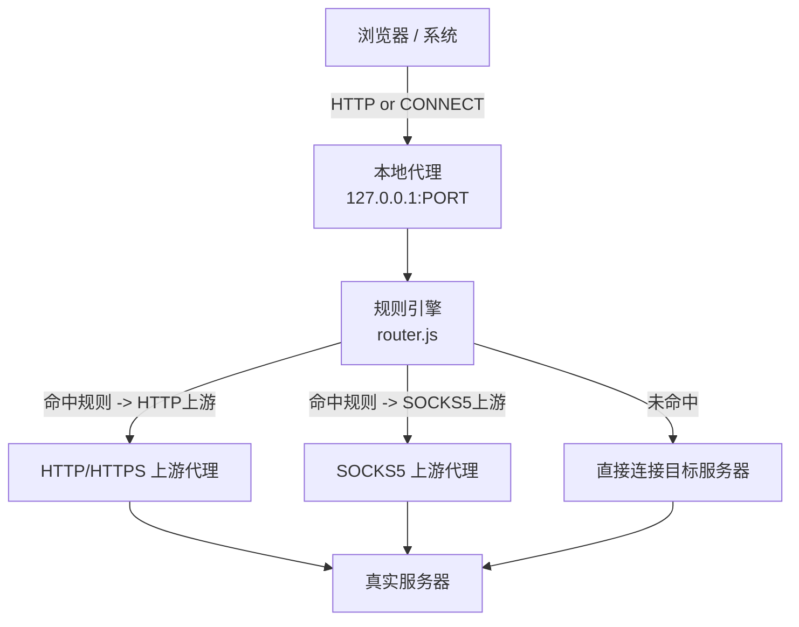

# 本地域名路由代理实现方案

## 目录结构

```
local-proxy/
├── package.json
├── config.json          # 规则配置（支持热重载）
├── src/
│   ├── index.js         # 入口，启动代理服务器
│   ├── proxy.js         # 核心代理服务器逻辑
│   ├── router.js        # 域名规则匹配引擎
│   ├── forwarder.js     # 上游代理转发逻辑（HTTP / SOCKS5）
│   └── config-watcher.js # 配置文件热重载监听
```

## 架构流程



## 关键模块说明

### 1. `config.json` — 配置文件结构

```json
{
  "port": 8080,
  "rules": [
    {
      "match": "*.aisee.woa.com",
      "matchType": "suffix",
      "upstream": {
        "type": "http",
        "host": "proxy.example.com",
        "port": 8888
      }
    },
    {
      "match": "test.example.com",
      "matchType": "exact",
      "upstream": {
        "type": "socks5",
        "host": "127.0.0.1",
        "port": 1080
      }
    }
  ],
  "defaultAction": "direct"
}
```

支持 `matchType`：`exact`（精确）、`suffix`（后缀通配）、`regex`（正则）

### 2. `proxy.js` — 核心代理服务器

- 使用 Node.js 原生 `http.createServer()` 监听端口
- 处理两种请求：
  - **HTTP 请求**（`GET/POST` 等）：从 `Host` 头提取域名，按规则路由后将完整请求转发
  - **HTTPS 隧道**（`CONNECT` 方法）：从 `CONNECT host:port` 提取域名，按规则路由后做 TCP 双向管道透传（不解密 TLS）

### 3. `router.js` — 规则引擎

- 按顺序遍历 `rules` 数组，首次命中即返回对应 upstream 配置
- 无命中时返回 `defaultAction`（`"direct"` 表示直连）

### 4. `forwarder.js` — 上游转发

| 场景 | HTTP 上游 | SOCKS5 上游 | 直连 |
|------|-----------|-------------|------|
| HTTP 请求 | 将请求转发到上游 HTTP 代理 | 通过 socks 建立 TCP 连接后发送请求 | 直接连目标 |
| HTTPS CONNECT | 向上游发 `CONNECT` 建立隧道后双向管道 | 通过 socks 连接目标后双向管道 | 直接 TCP 连目标后双向管道 |

SOCKS5 转发使用 npm 包 [`socks`](https://www.npmjs.com/package/socks)（纯 JS，无需 native 依赖）

### 5. `config-watcher.js` — 热重载

- 使用 `fs.watch()` 监听 `config.json` 变更
- 文件变化时重新解析并替换内存中的规则，下一个请求即生效
- 解析失败时保留旧配置并打印错误，不影响服务

## 依赖

- [`socks`](https://www.npmjs.com/package/socks)：SOCKS5 连接支持
- Node.js 内置：`http`、`net`、`fs`、`url`（无需 Express 等框架）

## macOS 浏览器接入方式

启动后，在浏览器或系统网络设置中将 HTTP 代理指向 `127.0.0.1:PORT` 即可。命令行快速设置：

```bash
networksetup -setwebproxy Wi-Fi 127.0.0.1 8080
networksetup -setsecurewebproxy Wi-Fi 127.0.0.1 8080
```

关闭时执行：

```bash
networksetup -setwebproxystate Wi-Fi off
networksetup -setsecurewebproxystate Wi-Fi off
```
